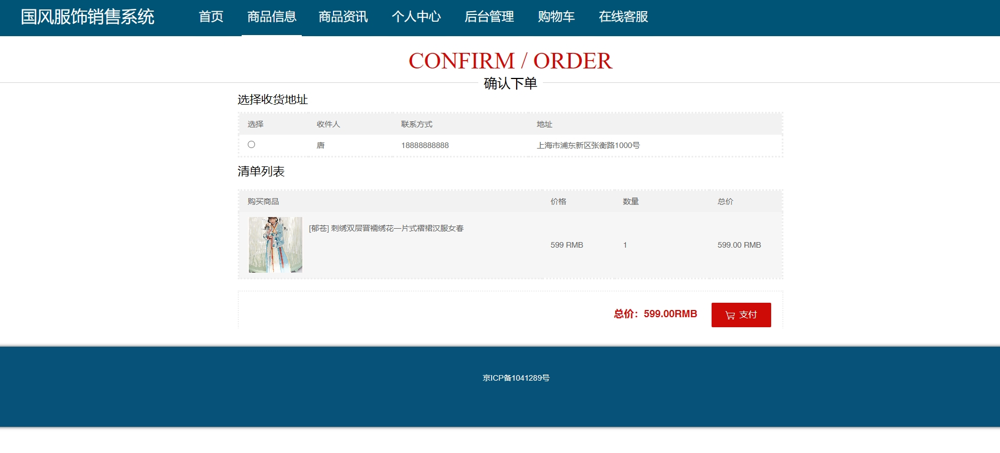

# 1.项目介绍
- 系统角色：管理员、普通用户
- 功能模块：管理员（用户管理、商品管理、分类管理、订单管理、系统管理、在线客服等），普通用户（登录注册、个人中心、评价管理、收藏管理、订单管理等、咨询服务等）
- 技术栈：SpringBoot、Vue（管理web）、Layui（门户），MyBatis等
- 测试环境：idea2024，mysql5,7，jdk1.8，maven3等
# 2.项目部署
- 通过navicat创建数据库，编码为utf8mb4, 我的排序规则默认是utf8mb4_general_ci， 然后导入sql
- 通过idea打开项目，根据本地数据库环境修改src/main/resources/application.yml   11-14行
- 启动项目
- 管理web：http://localhost:8080/springboot7z60r/admin/dist/index.html  管理员账号密码abo、abo
- 门户：http://localhost:8080/springboot7z60r/front/index.html  普通用户账号密码：tang、123456，或者查看用户表
# 3.项目部分截图

# 4.获取方式
[戳我查看](https://gitee.com/aven999/mall)